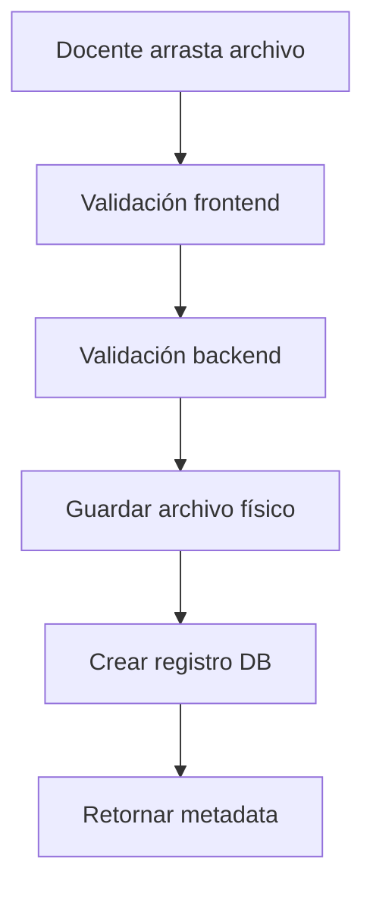
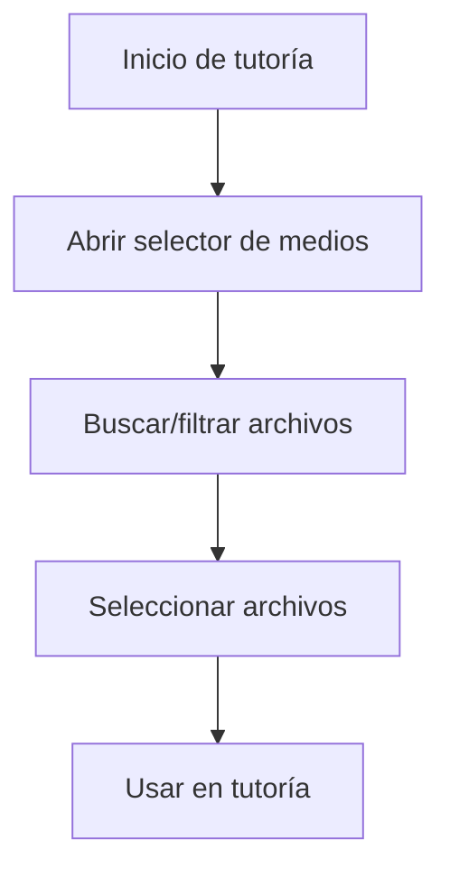

# Sistema de Biblioteca de Medios para Docentes

Este sistema permite a los docentes gestionar una biblioteca centralizada de archivos multimedia que pueden reutilizar en múltiples tutorías, evitando duplicación de archivos en la base de datos.

## Características Principales

### 🎯 **Funcionalidades Implementadas**

- **Subida de Archivos con Drag & Drop**: Interfaz intuitiva para arrastrar y soltar archivos
- **Gestión Centralizada**: Cada docente tiene su propia biblioteca personal de medios
- **Validación de Archivos**: Control de tipos y tamaños permitidos
- **Previsualización**: Vista de archivos con iconos según tipo de contenido
- **Edición de Metadatos**: Capacidad de agregar/editar descripciones
- **Búsqueda y Filtrado**: Buscar archivos por nombre o descripción, filtrar por tipo
- **Selector de Medios**: Componente reutilizable para seleccionar archivos en tutorías

### 📁 **Tipos de Archivo Soportados**

#### Imágenes
- JPEG (.jpg, .jpeg)
- PNG (.png)
- GIF (.gif)
- WebP (.webp)

#### Documentos
- PDF (.pdf)
- Microsoft Word (.doc, .docx)
- Microsoft PowerPoint (.ppt, .pptx)

#### Multimedia
- Videos: MP4, WebM, OGG
- Audio: MP3, WAV, OGG

### 🔒 **Seguridad y Validación**

- **Límite de Tamaño**: Máximo 10MB por archivo
- **Autenticación**: Solo docentes pueden acceder a sus bibliotecas
- **Autorización**: Cada docente solo puede ver/editar sus propios archivos
- **Validación de Tipos**: Solo tipos de archivo permitidos
- **Nombres Únicos**: Sistema de UUID para evitar conflictos

## Estructura Técnica

### Backend (FastAPI)

#### Modelos de Base de Datos

```python
class TeacherMediaFile(Base):
    __tablename__ = "teacher_media_files"
    
    id = Column(Integer, primary_key=True)
    teacher_id = Column(Integer, ForeignKey("professors.id"))
    filename = Column(String, nullable=False)          # Nombre único del archivo
    original_filename = Column(String, nullable=False) # Nombre original
    file_path = Column(String, nullable=False)         # Ruta física del archivo
    file_size = Column(Integer)                        # Tamaño en bytes
    mime_type = Column(String)                         # Tipo MIME
    uploaded_at = Column(DateTime)                     # Fecha de subida
    description = Column(Text)                         # Descripción opcional
```

#### Endpoints API

- `POST /teachers/{teacher_id}/media` - Subir archivo
- `GET /teachers/{teacher_id}/media` - Listar archivos del docente
- `GET /teachers/{teacher_id}/media/{file_id}` - Descargar archivo específico
- `PUT /teachers/{teacher_id}/media/{file_id}/description` - Actualizar descripción
- `DELETE /teachers/{teacher_id}/media/{file_id}` - Eliminar archivo

#### Almacenamiento

```
/workspace/backend/uploads/teacher_media/
├── {uuid1}.pdf
├── {uuid2}.jpg
├── {uuid3}.mp4
└── ...
```

### Frontend (React)

#### Componentes Principales

1. **`TeacherMediaLibrary.jsx`**
   - Interfaz principal de gestión de biblioteca
   - Drag & drop para subida de archivos
   - Vista de cuadrícula con tarjetas de archivo
   - Funcionalidades CRUD completas

2. **`MediaFileSelector.jsx`**
   - Modal para seleccionar archivos en tutorías
   - Búsqueda y filtrado avanzado
   - Selección múltiple
   - Integrable en otros componentes

#### Rutas

- `/teacher/media` - Biblioteca de medios del docente

## Flujo de Uso

### 1. Subida de Archivos



### 2. Uso en Tutorías



## Instalación y Configuración

### Prerrequisitos

1. **Backend**: FastAPI con dependencias
   ```bash
   pip install python-multipart
   ```

2. **Base de Datos**: Aplicar migraciones
   ```bash
   alembic upgrade head
   ```

3. **Directorio de Uploads**: Creado automáticamente
   ```
   /workspace/backend/uploads/teacher_media/
   ```

### Configuración Docker

El Dockerfile incluye `docker-compose` para gestión de contenedores:

```dockerfile
RUN curl -L "https://github.com/docker/compose/releases/latest/download/docker-compose-$(uname -s)-$(uname -m)" -o /usr/local/bin/docker-compose \
    && chmod +x /usr/local/bin/docker-compose
```

## Migración de Base de Datos

### Aplicar Migraciones

```bash
# Desde la máquina host
docker-compose exec backend alembic upgrade head

# Crear nueva migración (si hay cambios)
docker-compose exec backend alembic revision --autogenerate -m "descripción"
```

### Estado de Migraciones

La tabla `teacher_media_files` se crea con la migración:
`06eb64206f65_add_teacher_media_files_table.py`

## Integración con Sistema de Tutorías

### Modelo de Recursos

```python
class Resource(Base):
    __tablename__ = "resources"
    
    id = Column(Integer, primary_key=True)
    tutorship_id = Column(Integer, ForeignKey("tutorships.id"))
    media_file_id = Column(Integer, ForeignKey("teacher_media_files.id"), nullable=True)
    title = Column(String)
    file_url = Column(String)  # Para archivos externos
    uploaded_at = Column(DateTime)
```

### Flujo de Integración

1. **Docente sube archivos** → Biblioteca de medios
2. **Durante tutoría** → Selecciona archivos de biblioteca
3. **Sistema vincula** → Archivo con tutoría específica
4. **No duplicación** → Mismo archivo, múltiples tutorías

## Monitoreo y Mantenimiento

### Limpieza de Archivos Huérfanos

```python
# Script para eliminar archivos físicos sin registro en DB
def cleanup_orphaned_files():
    # Implementar lógica de limpieza
    pass
```

### Estadísticas de Uso

- Archivos por docente
- Tamaño total de biblioteca
- Tipos de archivo más usados
- Frecuencia de reutilización

## Próximas Mejoras

### Funcionalidades Pendientes

- [ ] **Categorización**: Organizar archivos en carpetas/categorías
- [ ] **Compartir**: Permitir compartir archivos entre docentes
- [ ] **Versioning**: Control de versiones de archivos
- [ ] **Compresión**: Optimización automática de imágenes/videos
- [ ] **CDN Integration**: Integración con servicios de CDN
- [ ] **Previsualización**: Vista previa sin descarga
- [ ] **Metadatos Avanzados**: Tags, categorías, ratings

### Optimizaciones

- [ ] **Lazy Loading**: Carga bajo demanda de archivos grandes
- [ ] **Thumbnails**: Generación automática de miniaturas
- [ ] **Streaming**: Reproducción en streaming para videos
- [ ] **Caching**: Cache de metadatos para mejor rendimiento

## Troubleshooting

### Problemas Comunes

1. **Error 413 - Archivo muy grande**
   - Verificar límite de 10MB
   - Ajustar configuración de nginx/servidor

2. **Error 403 - Sin permisos**
   - Verificar autenticación de usuario
   - Confirmar rol de docente

3. **Error 500 - Fallo en subida**
   - Verificar permisos de directorio uploads
   - Comprobar espacio en disco

### Logs y Debugging

```python
# Activar logging detallado
logging.basicConfig(level=logging.DEBUG)
```

## Contribución

### Estructura de Commits

- `feat:` Nueva funcionalidad
- `fix:` Corrección de bugs
- `docs:` Documentación
- `refactor:` Refactorización de código
- `test:` Pruebas

### Testing

```bash
# Ejecutar tests
pytest backend/tests/

# Test específico de biblioteca de medios
pytest backend/tests/test_media_library.py
```
